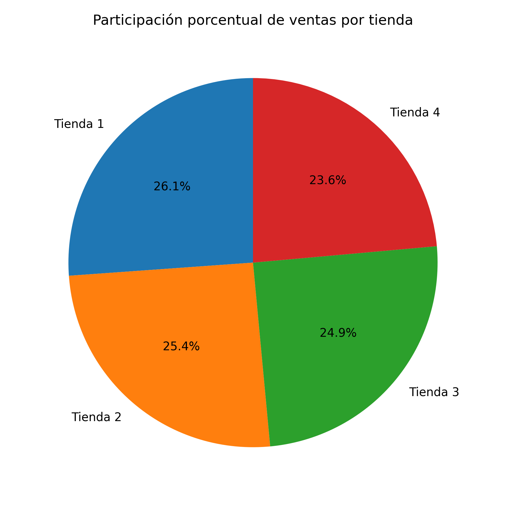
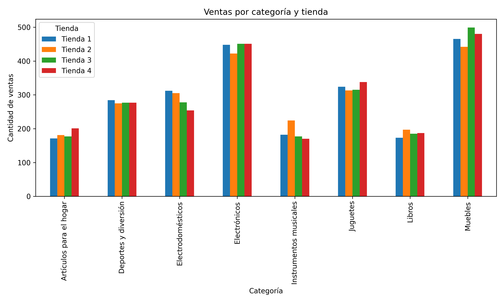
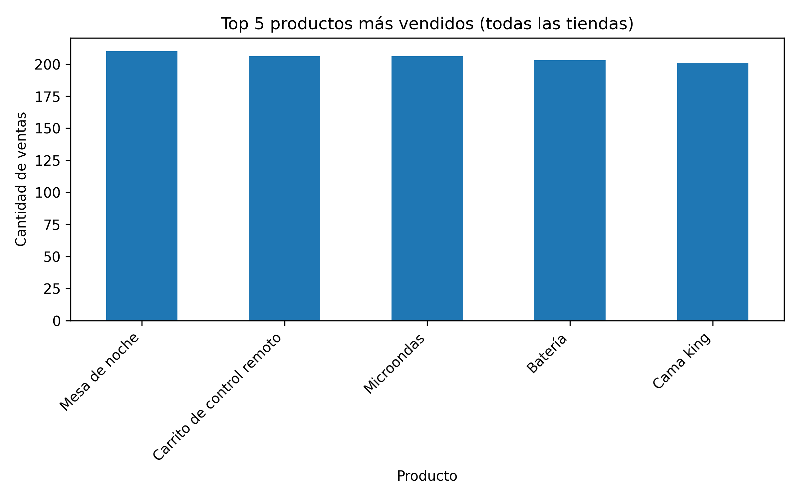
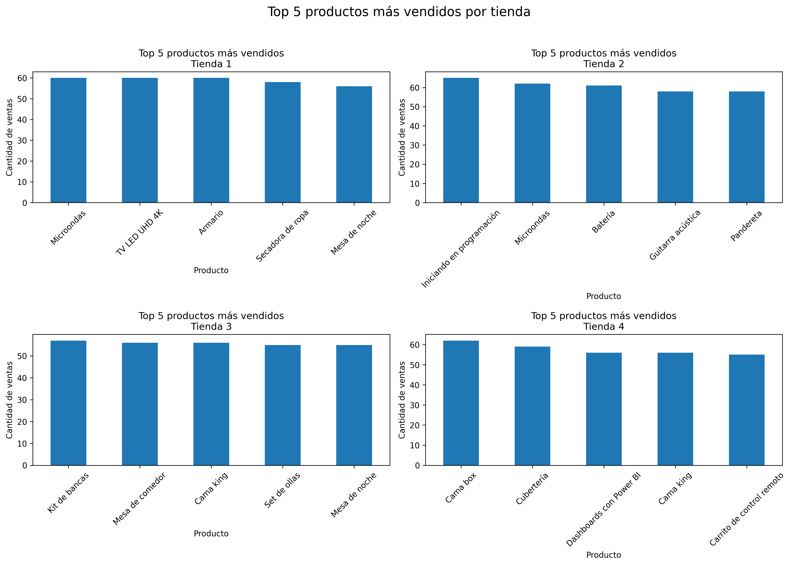
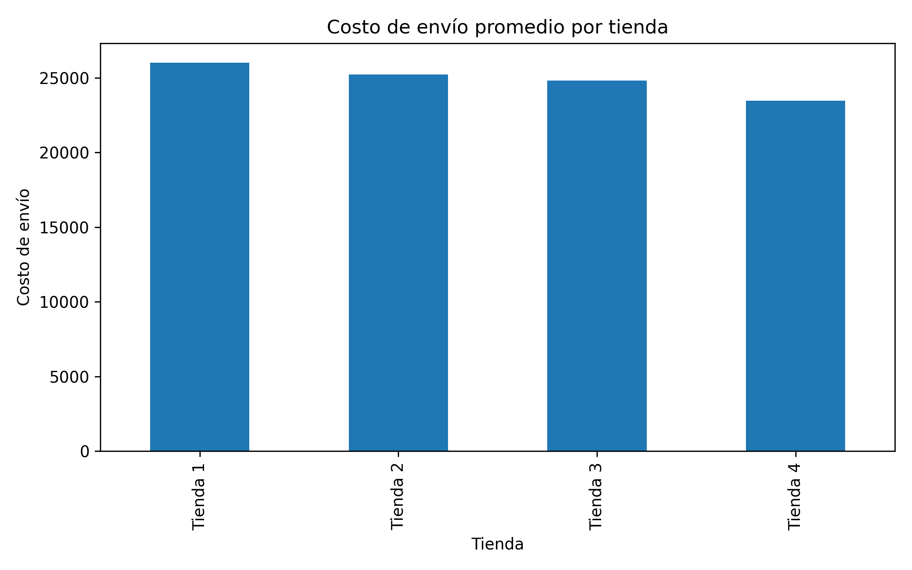
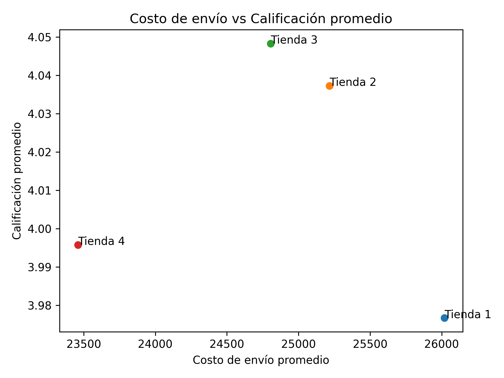
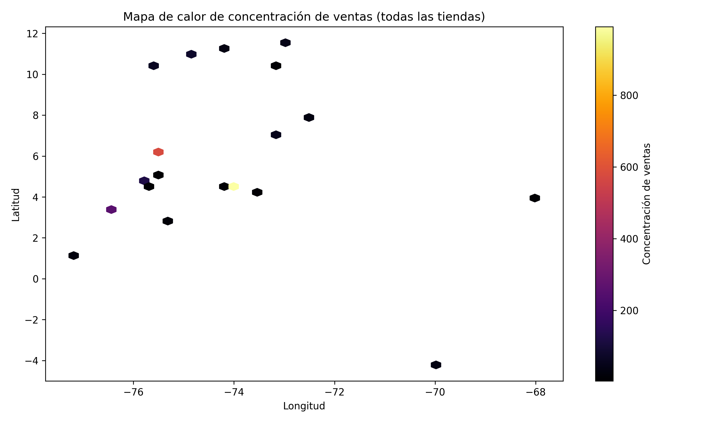

# 📊 Análisis de Ventas – Comparación de Tiendas

## 📌 Descripción del proyecto
Este proyecto analiza y compara el desempeño de **cuatro tiendas** a partir de datos reales de ventas, con el objetivo de apoyar la **toma de decisiones estratégicas** orientadas a la optimización del patrimonio y la reinversión.

El análisis evalúa métricas comerciales, operativas y geográficas, permitiendo identificar **fortalezas, debilidades y oportunidades** en cada tienda.

El desarrollo se realizó en **Python**, utilizando técnicas de análisis exploratorio de datos y visualización.

---

## 🧰 Tecnologías utilizadas
- Python  
- Pandas  
- NumPy  
- Matplotlib  
- Folium  
- Google Colab  

---

## 📂 Fuente de datos
Los datos provienen de **Alura LATAM** y corresponden a cuatro archivos CSV, uno por tienda:

- Tienda 1  
- Tienda 2  
- Tienda 3  
- Tienda 4  

Cada archivo incluye:
- Producto  
- Categoría del producto  
- Precio  
- Costo de envío  
- Fecha de compra  
- Calificación  
- Método de pago  
- Coordenadas geográficas (`lat`, `lon`)  

---

## 🔍 Análisis realizados

### 1️⃣ Ingresos totales y participación porcentual
Se calculan los ingresos totales por tienda y su **participación porcentual** sobre el total de ventas.

📌 **Gráfico recomendado**:  
**Gráfico de torta (pie chart)** para visualizar claramente el peso relativo de cada tienda.

---

### 2️⃣ Ventas por categoría
Se analizan las categorías de productos más vendidas por tienda, permitiendo comparar el comportamiento de la demanda entre tiendas y detectar especialización o concentración por tipo de producto.

📌 **Gráfico recomendado**:  
Gráfico de barras agrupadas por tienda y categoría.

---

### 3️⃣ Productos más y menos vendidos por tienda
Se identifican los productos con **mayor y menor volumen de ventas** en cada tienda, información clave para decisiones de inventario y catálogo.

📌 **Visualización sugerida**:
- Tabla resumen comparativa
- Gráfico de barras (top productos)

#### 📊 Top 5 productos más vendidos por tienda

---

### 4️⃣ Costo de envío promedio por tienda
Se calcula el costo promedio de envío por tienda para comparar el impacto operativo asociado a la experiencia de compra.

📌 **Gráfico recomendado**:  
Gráfico de barras simple.

---

### 5️⃣ Relación entre costo de envío y calificación
Se analiza la relación entre el **costo de envío promedio** y la **calificación de los clientes**, buscando patrones que puedan influir en la percepción del servicio.

📌 **Gráfico recomendado**:  
Gráfico de dispersión (scatter plot).

---

## 🌍 Análisis geográfico de las ventas (Actividad adicional)
Se incorpora un análisis geográfico utilizando las coordenadas de latitud y longitud para explorar la distribución espacial de las ventas.

Se incluyen:
- Mapa de concentración de ventas
- Mapa interactivo con capas por tienda

📌 **Visualizaciones sugeridas**:
- Mapa de calor
- Mapa interactivo (Folium)

---

## 📈 Conclusión

De acuerdo con los análisis realizados, la **Tienda 4** presenta una menor participación en los ingresos totales, manteniendo un desempeño operativo adecuado. **Vender esta tienda permitiría obtener liquidez** sin comprometer significativamente el flujo principal del negocio, **reduciendo el riesgo patrimonial y facilitando la reinversión.**

👉 **Se recomienda vender la **Tienda 4** como una decisión estratégica de ** optimización del portafolio**.**

---

## ▶️ Cómo ejecutar el proyecto
1. Abrir el notebook en **Google Colab**
2. Ejecutar las celdas en orden
3. Verificar la instalación de librerías
4. Analizar los resultados y visualizaciones generadas

---

## ✍️ Autor
**Daniela Puebla**  
Proyecto de Análisis de Datos – Data Science

